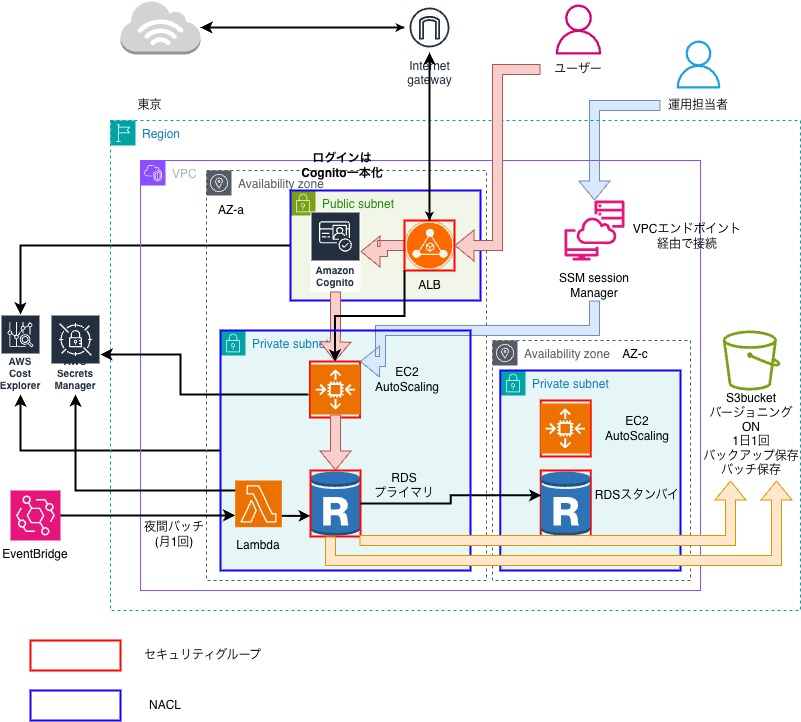

## 図書管理システムの運用構築(Claude4.6がクライアント役)

## 要件定義(インフラ)
1. 図書管理システムを、社内の複数拠点（東京:20名・大阪:10名）のスタッフ約30名が使えるようにすること
2. Spring Bootアプリを、ブラウザからアクセスできるようにすること
3. ユーザーのログイン情報・貸出し履歴データはシステム障害や誤操作で、絶対に消えてはいけないこと
4. 月に1回、夜間バッチ処理(0時~5時の間)を実施すること
5. 夜間バッチ以外は、システムダウンしないこと(24時間稼働)
6. 将来的に(東京:70名・大阪:30名)100名規模になる予定
7. セキュリティは社員のみをアクセス可能にすること
8. コストは、月3万円以下にすること

## インフラアーキテクチャ設計
1.高可用性: 
マルチAZ構成にすることで、システムダウンしてもダウンタイムなしで復旧ができるため(要件5対応)

2.EC2インスタンス: 
管理や運用面では、Fargateがベストですが、コストが月3万円と低コストの希望のため、EC2インスタンス(リザーブドインスタンス)で低コスト稼働を実現(要件8対応)

3.S3バケット(バージョニングON・バックアップ): 
誤操作でデータを絶対に消えないように、バージョニングでデータを復元・保護対応(要件3対応)

4.AutoScaling: 
スタッフが100名規模に拡大ということもあり、アクセスが集中した際に自動スケーリングでコスト最適化を図った(要件6対応)

5.AWS Cognito: 
セキュリティグループのIP制限を考えたが、大阪拠点では動的IPを使用していたため、Cognitoを選択
ALBの認証機能とAWS Cognitoを活用し、OIDC(OpenIDConnect)にてSSO(シングルサインオン)対応(要件7対応)

6.ALB・Privateサブネット: 
社員のみのアクセスのため、インターネットをALBで繋ぎ、プライベートパブリック内でアプリ起動し、必要最小限のアクセスにしセキュリティ対策を図った(要件7対応)

7.RDS自動バックアップ 
システム障害時にデータが消えないように、RDSの自動バックアップ機能を活用し、いつでも復元可能な設計(要件3対応)

8.EventBridge→Lambda→S3(夜間バッチ): 
夜間バッチは月に1回・図書システムのデータなのでそこまで時間が掛からないので、コスト最適化を優先にし、安価なLambdaを活用(要件4・8対応)

9.SSM session Manager: 
踏み台サーバー不要・SSH鍵管理不要・操作ログをCloudTrailで記録できるため、SSMを選択
運用担当者のログインをSSM session Managerを活用し、低コストになるように設計(要件8対応)

（10番以降は、要件とは別で実装を実施） 
10.Secrets Manager(DBパスワード管理)
ソースコードにパスワードを直書きすると、GitHubに誤コミットした際に情報漏洩が発生するリスクがある。
そのため、DB接続情報をSecrets Managerで一括管理し、EC2起動時・Lambda実行時に動的取得する設計を追加

## インフラアーキテクチャ構成

## 要件定義(CI/CDパイプライン)
1. 手動でデプロイ（作業が長期化し担当者の負担が大きい）のため、自動化で負担を減らすこと
2. 本番環境に間違ったコードをデプロイすることがあるため、デプロイ承認フローを追加し確認フェーズを取り入れること
3. テストを実行し忘れてバグが本番環境に混入したことがあるため、テストステージを追加し確認フェーズを取り入れること
4. GitHubでコード管理をしているため、GitHubでpushしたら自動的にデプロイできるようにすること
5. 本番環境に影響が出ないようにし、万が一デプロイに失敗したらすぐに前のバージョンに戻せるようにすること
6. コストはインフラ構築+CI/CDパイプラインで月3万円以内に抑えること

## CI/CDパイプラインアーキテクチャ設計
1. AWS CodeDeploy・GitHub Actions: 
GitHubでコードを管理してるため、GitHub ActionsとAWS CodeDeployを併せることで、
CI/CDパイプラインを最小限の構築にするために設計(要件1,4対応)

2. GitHub Actionsのデプロイ承認: 
誤ったコードが本番環境にデプロイされないために、デプロイ前に責任者の確認フェーズを追加。さらにSlackを活用しているため、AWS SNS + AWS Chatbotを実装することで責任者にSlack通知が届き、デプロイ承認フローで確認をするように設計(要件2対応)

3. AWS CodeDeployのテストステージを追加 
CodeDeployのテストステージを追加することで、テストを実行し忘れてバグが本番環境に混入することを防ぐように設計(要件3対応)

4. ブルーグリーンデプロイ方式 
ブルーグリーンデプロイを実装することで、現行の本番環境に影響を与えず、すぐに前のバージョンに戻せるため採用。
グリーン環境切り替え後、1日間は両環境を維持し、CloudWatchでメトリクスを監視。問題なければブルー環境を削除。
リザーブドインスタンスのため、1日間の追加コストは最小限に抑えられる。(要件5,6対応)

5. GitHub Actions・AWS側でのコスト最適化 
GitHub Actions: 
(1) キャッシュの積極活用をすることで、ビルド時間を大幅に短縮させ低コスト
(2) セルフホステッドランナーを利用 
既存システムでは、EC2(リザーブドインスタンス)サーバーを使用しているため、新たにサーバーを作成せず低コストのリザーブドインスタンスのサーバーを使用することで追加費用を抑えた。 
さらに、セルフホステッドランナーは、プライベートサブネットとの相性も良いのでセキュリティ面でも運用向上を図った 
(3) GitHub ActionsのUsageページで実行時間・コストを確認し、
不要なジョブの削減やキャッシュ効果を定期的に見直す
AWS: 
(1) GitHub ActionsからAWSへの認証をOIDC活用 
アクセスキーの管理が不要で、セキュリティが向上し運用コストも抑えられる
(2) Lambdaの活用 
AWS CodeDeployを使う場合、従量課金制のLambdaを活用することで低コスト化を図った 
(要件6対応)

## CI/CDパイプラインアーキテクチャ構成